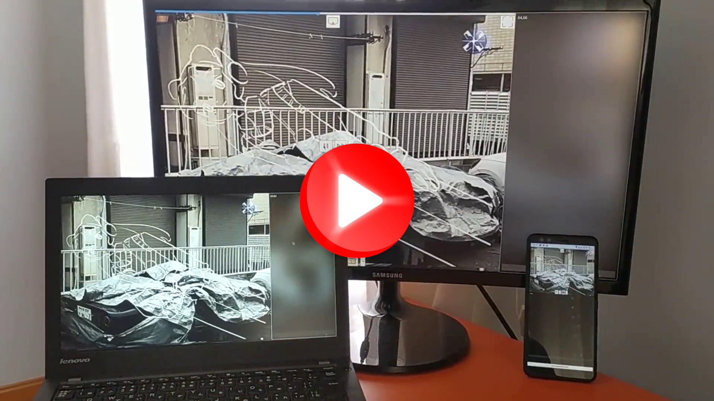
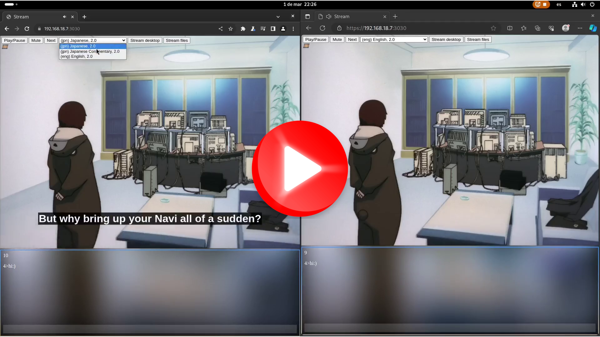

# xtream
A place to watch videos with friends, without loss of quality. Just share your link and drop a video file!

No need to set up a server or install any program or extension.

[Just access https://xtream.chabal.es](https://xtream.chabal.es)

## Demos
This is not screen sharing!

### Testing on different devices

### Testing subtitles and audio tracks

## How does it work?
The videos you drop are shared with your friends in a peer-to-peer manner, using WebRTC data channels. The files are encrypted from end to end and they don't go through our server.

It splits the videos in small chunks using FFmpeg.wasm, so the receiver doesn't need to download the entire video to start watching.

## Features
- Video files are transferred without quality loss.
- Each user can choose their preferred audio and subtitle language.
- Share your screen (browsers' screen capture is quite lossy, expect Discord-like video quality).
- Convenient text chat.

Supported video formats: mp4, mkv, webm, mov.

Supported video codecs:
- h264 -> works pretty much anywhere, most devices have h264 hardware acceleration.
- AV1 -> much better quality for the same space. Royalty-free codec, works on most newer devices. Can drain the battery faster than h264 on mobile devices. It usually takes more time to encode.
- VP8, VP9 -> widely supported by browsers, but there's usually no reason to use them instead of h264 or AV1.
- h265/HEVC -> it only works on certain compatible browsers running on devices with hardware support (or with the non-free Windows HEVC extension). I don't recommend it if you can avoid it, unless you know everybody on your room can play it.

## Future features
- Full .ass subtitle support. At the moment, subtitles are converted to WebVTT, which can cause unexpected behaviors.
- Voice chat.
- Mesh networking to distribute the load across everybody in the same room (right now, the uploader of the file sends it to everyone, so we depend on their upload speed).
- TURN server for networks with restrictive NATs.
- File share.
- Stream from OBS with WebRTC support (I've already been experimenting with this, it wouldn't be hard to add).
- P2P radio?

## Known issues
- Sometimes the video isn't loaded on the receiver side, it's usually fixed by refreshing the page.
- Depending on the Internet provider, some users can't connect to others. This is often due to CG-NAT, and it happens more on cellular connections. I'm working to fix that.
- As already mentioned, subtitles sometimes show hidden comments or don't appear as expected.

Still on development, leave an issue on my [Codeberg repo](https://codeberg.org/cosstab/xtream) if you find something weird!

## Building the server
Remember that you don't need to build your own server!

First, you'll need to set up cargo if you don't have it.

You can run the server like this for development: 
`cargo run -- YOUR_ARGUMENTS_HERE`

Or build a binary with: 
`cargo build --release`

If you built the binary, you'll need to move it from target/release and put it next to a copy of the "frontend" folder. Then you can run it like this:
`./xtream YOUR_ARGUMENTS_HERE`

HTTPS is **mandatory** for WebRTC, so you'll have to make it work somehow. For example, I made some self-signed certificates for developing on local, saved them as cert.pem and key.rsa and put them on my current folder. Then it can be run like this:

`cargo run -- 192.0.2.100 -p 443 --https`

The server could now be accessed on https://192.0.2.100, after ignoring the warnings about self-signed certificates.
